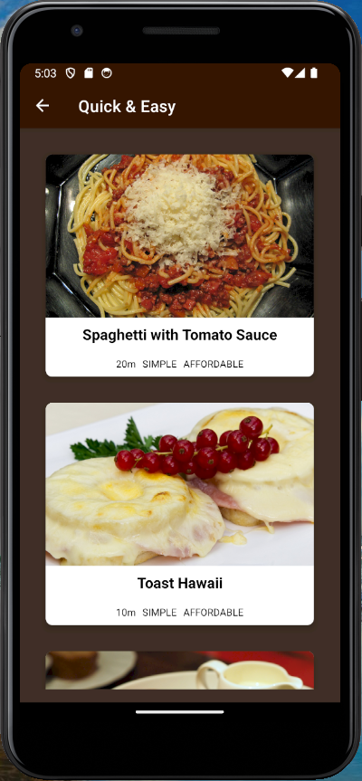

# Meals App - React Native 

  ## Description

  A meal recipe application built with React Native. View meals by category, view recipes for individual meals, and save favorites to Favorites page.

  ### App Screenshots

  #### App Home Page - Select a Category

  

  #### Meals Page - All meals for the selected Category

  

  #### Meal Detail Page - Recipe for selected Meal
  
  

  #### Favorites - Favorite Recipes

  
  
  ## Table of Contents
  
  - [Installation](#installation)
  - [Usage](#usage)
  - [License](#license)
  - [Contributing](#contributing)
  - [Tests](#tests)
  - [Questions](#questions)
  
  ## Installation
  
  npm install
  
  ## Usage
  
  simply click on a Category on the home screen to see meals under that Category.  Then click on a Meal to see the details (ingredients, steps for preparing).  Click on Star on upper right of the recipe page to save to favorites.  Navigate to Favorites page from the home screen to see all recipes that have been favorited.

  ## License
This application is covered under the MIT License.
 For more information: https://opensource.org/licenses/MIT
  
  ## Contributing
  N/A
  
  ## Tests
  N/A

  ## Questions
  Contact Info 
  GitHub user name: BillStephens2022 
  Link to GitHub profile: https://github.com/BillStephens2022 
  Email: stephensbill17@gmail.com
